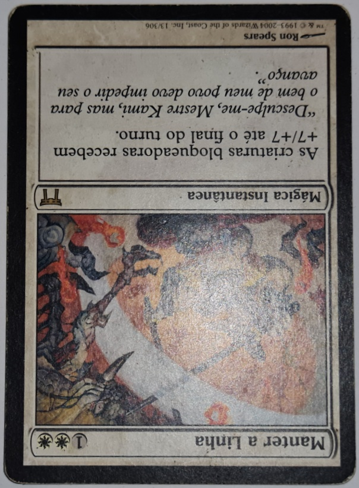

# Isolate-objects-from-the-background-of-photos-using-python-and-opencv
Isolate objects from the background of photos using python and opencv.

 
  
  
  
  

How to use: Put a folder called card-pairs in the same folder as this solution.
  

Use the proper naming conventions:
  
